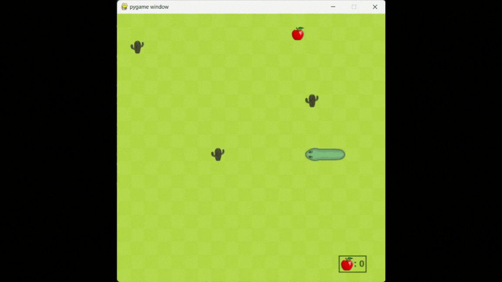

# 🐍 Snake 

Acesta resprezintă proiectul la disciplina **Python**. Proiectul constă într-o interfață grafică minimală ce oferă utilizatorului posibilitatea de a juca jocul Snake. Când script-ul se rulează, se începe o sesiune de joc ce este formată din mai multe partide de joc, iar după fiecare partidă de joc se afișează scorul obținut, cu posibilitatea de continuare sau de încheiere a sesiunii.

De asemenea, se reține cel mai mare scor obținut, ce se actualizează, după caz, pe parcursul sesiunii de joc. La încheierea sesiunii, recordul este afișat pe ecran.

## Interfața

