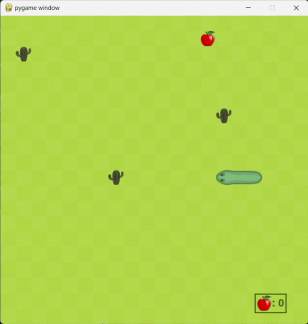

# 🐍 Snake 

Acesta resprezintă proiectul la disciplina **Python**. Proiectul constă într-o interfață grafică ce oferă utilizatorului posibilitatea de a juca jocul Snake. Când script-ul se rulează, se începe o sesiune de joc ce este formată din mai multe partide de joc, iar după fiecare partidă de joc se afișează scorul obținut, cu posibilitatea de continuare sau de încheiere a sesiunii.


De asemenea, se reține cel mai mare scor obținut, ce se actualizează, după caz, pe parcursul sesiunii de joc. La încheierea sesiunii, recordul este afișat pe ecran.

## Modul de rulare
Acest joc se lansează din consolă, scriind comanda:
```
    python3 main.py table.json
```
unde `table.json` este un fișier JSON cu structura următoate:
```json
{
  "cells": 20,
  "size_of_a_cell": 30,
  "obstacles": [
    {
      "x": 1,
      "y": 2
    },
    {
      "x": 7,
      "y": 10
    },
    {
      "x": 14,
      "y": 6
    }
  ]
}
```
unde:
- `cells` este numărul total de celule care pot fi folosite. Dacă nu este precizată, valoarea default va fi 20.
- `size_of_a_cell` reprezintă dimensiunea unei celule în pixeli. Dacă nu este precizată, valoarea default va fi 30.
- `obstacles` este o listă de perechi de numere ce indică coordonatele obstacolelor pe tabla de joc.

Rulat în acest mod, interfața va fi următoarea:


----------------------------------------------------------------------------------------------------------------------------------------

Bineînțeles că utilizatorul poate alege valori diferite pentru `cells`, `size_of_a_cell` sau pentru coordonatele obstacolelor, iar în cazul în care acesta va stabili pentru variabila `size_of_a_cell` o valoare diferită de 30, în locul imaginilor vor fi afișate dreptunghiuri având culoarea componentelor inițiale.

Un exemplu în acest sens poate fi urmărit rulând următoarea comandă în terminal:
```
    python3 main.py table1.json
```
unde `table1.json` este un fișier JSON cu structura următoate:
```json
{
  "cells": 30,
  "size_of_a_cell": 20,
  "obstacles": [
    {
      "x": 10,
      "y": 10
    }
  ]
}

```
Rulat în acest mod, interfața va fi următoarea:


### Color Reference
Pentru al doilea caz discutat mai sus, am folosit următoarele culori:

| Color             | Hex                                                                |
| ----------------- | ------------------------------------------------------------------ |
| Snake |  #6a9e68 |
| Fruit |  #d90102 |
| Obstacle |  #384a0c |
| Table |  #afd746 |
| Grass |  #a7d13d |


## Regulile și modul de a juca 

Scopul jocului constă în acumulatea a cât mai multe puncte. Punctele se acumulează prin mâncatul a cât mai multe fructe (reprezentate aici prin mere) de către șarpe. Cu cât șarpele mănâncă mai multe fructe, cu atât corpul lui devine mai lung. Controlul șarpelui se realizează prin folosirea tastelor direcționale (sus, jos, stânga, dreapte).

O partidă de joc se termină în momentul în care:
- șarpele se ciocnește de propriul corp
- șarpele se ciocnește se un obstacol

Încheierea unei partide nu presupune și încheierea întregii sesiuni. Din momentul în care pornește scriptul, începe o sesiune care nu se termină decât prin a da click pe **X** în orice moment al jocului sau prin apăsarea tastei **y** atunci când utilizatorul ajunge la meniul din imaginea de mai jos:


Dacă, la acest moment, utilizatorul apasă tasta **n**, atunci va fi pornită o nouă partidă de joc, cu șarpele la poziția inițială și cu dimensiunile inițiale, iar dacă utilizatorul apasă tasta **y**, atunci va fi afișat recordul înregistrat pe întreaga sesiune, iar utilizatorul va putea alege dacă începe o nouă sesiune (caz în care recordul va fi resetat la valoarea 0), sau dacă închide fereastra, așa cum se poate vedea în imaginea de mai jos:


O sesiune de joc va arăta într-un mod asemănător cu cea care poate fi vizualizată în GIF-ul de mai jos:

[](snake.mp4)

## Resurse și materiale

- [Segmentele din corpul șarpelui](https://rembound.com/files/creating-a-snake-game-tutorial-with-html5/snake-graphics.png) utilizate sunt cele disponibile în articolul [Creating A Snake Game Tutorial With HTML5](https://rembound.com/articles/creating-a-snake-game-tutorial-with-html5)
- [Sunetul pentru mușcătură](https://pixabay.com/sound-effects/eating-sound-effect-36186/) este unul dintre [sunetele](https://pixabay.com/sound-effects/search/crunch/) de pe site-ul https://pixabay.com
- [Imaginea pentru măr](https://drawnbyhislight.com/wp-content/uploads/2019/07/How-to-draw-an-apple-8.jpg) a fost preluată din articolul [How to draw an apple step by step](https://drawnbyhislight.com/how-to-draw-an-apple).
- [Imaginea pentru obstacol (cactus)](https://www.shutterstock.com/ro/image-vector/cactus-icon-vector-logo-symbol-desert-1385104922) a fost preluată de pe pagina https://www.shutterstock.com.
- [Tool-ul folosit pentru ștergerea background-ului](https://www.remove.bg/upload).
- [Asocierea imaginilor cu segmente din corpul șarpelui](https://youtu.be/QFvqStqPCRU?feature=shared&t=4766)
